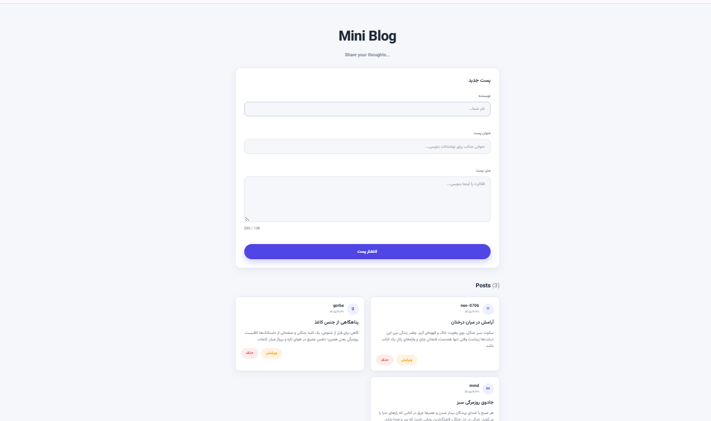

# Mini Blog

A modern **Mini Blog** application built step by step using **HTML**, **CSS**, and **Vanilla JavaScript**, with a future migration to **FastAPI** for the backend.

The goal of this project is not only to build a blog application, but also to practice writing clean, maintainable code using object-oriented JavaScript, modular architecture, and a professional Git workflow.

---

## Preview



---

## Features

### Current

- ✅ Create posts
- ✅ Edit existing posts
- ✅ Delete posts
- ✅ Cancel editing mode
- ✅ Client-side form validation
- ✅ Real-time field validation
- ✅ Character counter with warning states
- ✅ Dynamic posts counter
- ✅ Animated notification system
- ✅ Responsive modern UI
- ✅ Semantic HTML5
- ✅ CSS Variables
- ✅ Flexbox & CSS Grid
- ✅ Modular ES6 JavaScript
- ✅ Object-Oriented Design (OOP)

### Upcoming

- Local Storage persistence
- REST API integration
- FastAPI backend
- SQLite / PostgreSQL
- JWT Authentication
- Deployment

---

## Tech Stack

### Frontend

- HTML5
- CSS3
- Vanilla JavaScript (ES Modules)
- Object-Oriented JavaScript (OOP)

### Backend (Planned)

- FastAPI
- SQLAlchemy
- SQLite
- PostgreSQL
- JWT Authentication

---

## Project Structure

```text
mini-blog/
│
├── assets/
│
├── css/
│   └── style.css
│
├── js/
│   ├── app.js
│   ├── miniBlog.js
│   ├── post.js
│   ├── validator.js
│   ├── fieldError.js
│   └── notification.js
│
├── index.html
├── README.md
└── .gitignore
```

---

## Getting Started

Clone the repository

```bash
git clone https://github.com/YOUR_USERNAME/mini-blog.git
```

Enter the project directory

```bash
cd mini-blog
```

Run a local server

```bash
npx serve .
```

or simply open `index.html` in your browser.

---

## Current Capabilities

- Create new blog posts
- Edit existing posts
- Delete posts
- Cancel editing mode
- Validate form inputs
- Display inline validation errors
- Show animated notifications
- Count post characters in real time
- Display the total number of posts
- Responsive interface

---

## Roadmap

- [x] Responsive UI
- [x] Render posts dynamically
- [x] Create posts
- [x] Edit posts
- [x] Delete posts
- [x] Form validation
- [x] Notification system
- [x] Store posts in Local Storage
- [ ] Build REST API with FastAPI
- [ ] Connect frontend to backend
- [ ] JWT Authentication
- [x] Deploy application

---

## Learning Goals

This project is built to practice:

- Semantic HTML
- Modern CSS
- Responsive Design
- Vanilla JavaScript
- ES Modules
- Object-Oriented Programming (OOP)
- DOM Manipulation
- CRUD Operations
- Form Validation
- Event Delegation
- Git & GitHub Workflow
- REST API Development
- FastAPI
- Database Design

---

## Future Improvements

- Persist posts using Local Storage
- Search posts
- Filter and sort posts
- Dark mode
- Markdown support
- Image upload
- User authentication
- Backend integration

---

---

## 🌐 Live Demo

You can check out the live preview of the project here:

👉 **[View Live Demo](https://neo-0706.github.io/mini-blog/)**

## License

This project is created for learning, practice, and portfolio purposes.